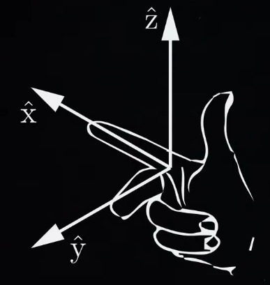
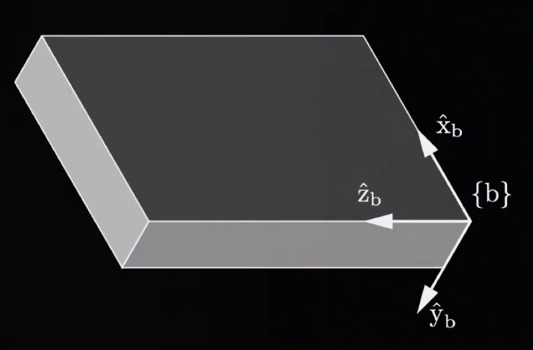
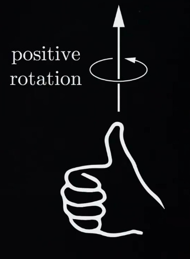

# Introdução aos Movimentos de Corpos Rígidos

Será utilizada representações implícitas de configurações, considerando o espaço como uma superfície imersa em um espaço de dimensão superior. Em outras palavras, nossa representação de uma configuração não utilizará um conjunto mínimo de coordenadas, além disso, as velocidades não serão a derivada temporal das coordenadas. 
Configurações de corpos rígidos são representadas usando quadros.

Um quadro nada mais é do que um sistema de coordenadas, no caso do destro conside de: 

Se quisermos representar a posição e a orientação de um corpo no espaço, fixamos um referencial ao corpo:

A configuração do corpo é dada pela posição da origem do sistema de coordenadas do corpo e pelas direções dos eixos de coordenadas do sistema de coordenadas do corpo, expressas nas coordenadas do referencial espacial do "mundo".  
**OBS:** Vamos considerar todos os referenciais como estacionários. 

A rotação positiva de um eixo é dada pela regra da mão direita:

Na proxima parte, veremos como representar a orientação de um corpo rígido. 