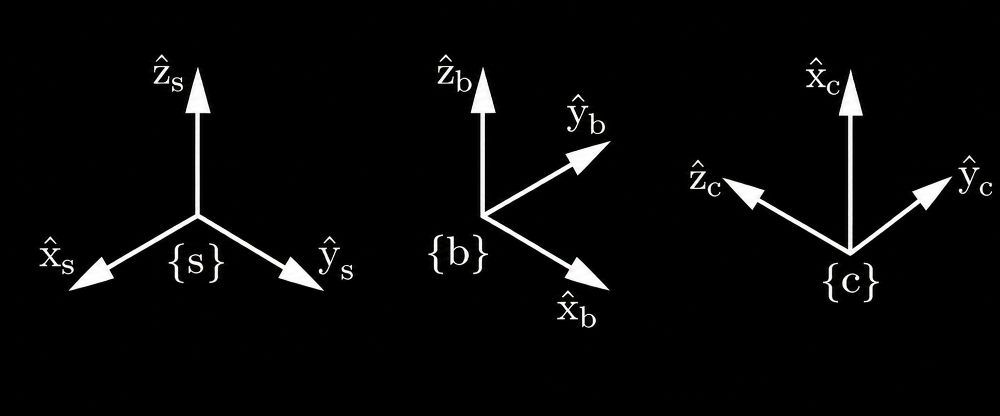
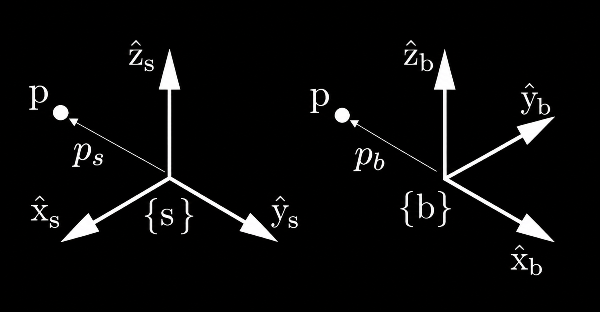
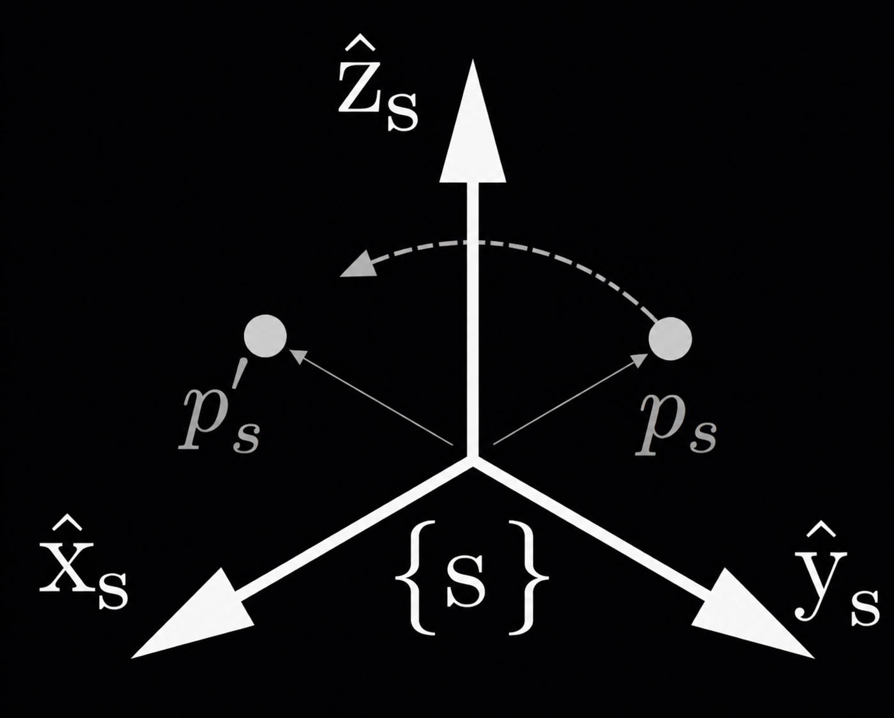
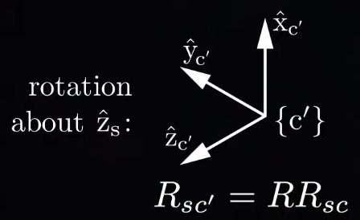
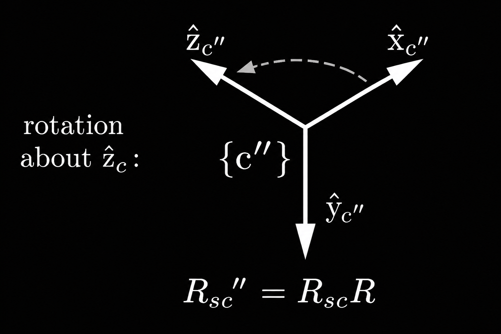

# Matrizes de Rotação

Neste tópico, vamos focar na **orientação de um corpo rígido**. O objetivo é entender como representamos a orientação de um corpo utilizando **matrizes de rotação**.

## Representação dos Quadros de Referência
Vamos considerar dois quadros de referência: {s} e {b}:

Os quadros são mostrados em locais diferentes, mas nosso foco está nas **orientações** desses quadros em relação a um sistema comum.

Podemos expressar a orientação do referencial {b} em relação ao referencial {s} escrevendo os eixos de coordenadas unitárias.
As matrizes que representam os eixos coordenados em relação ao sistema de coordenadas referencial são:

$$
\hat{x}_b = \begin{bmatrix} 0 \\ 1 \\ 0 \end{bmatrix}, \quad
\hat{y}_b = \begin{bmatrix} -1 \\ 0 \\ 0 \end{bmatrix}, \quad
\hat{z}_b = \begin{bmatrix} 0 \\ 0 \\ 1 \end{bmatrix}
$$

### Matriz de Rotação
Para representar a **matriz de rotação** completa que descreve a orientação do sistema {b} em relação ao sistema {s}, podemos combinar os vetores \( \hat{x}_b \), \( \hat{y}_b \) e \( \hat{z}_b \) como colunas em uma única matriz:

$$
R = \begin{bmatrix}
\hat{x}_b & \hat{y}_b & \hat{z}_b
\end{bmatrix}
= \begin{bmatrix}
0 & -1 & 0 \\
1 & 0 & 0 \\
0 & 0 & 1
\end{bmatrix}
$$

Observe que, apesar do espaço de orientações de um corpo rígido ter apenas 3 dimensões, a matriz de rotação possui 9 números. Isso implica que as 9 entradas da matriz estão sujeitas a 6 restrições.

#### Restrições das Matrizes de Rotação
Essas 6 restrições podem ser explicadas da seguinte forma:
1. Três dessas restrições indicam que **os vetores coluna da matriz \( R \) são unitários**, ou seja, cada coluna tem comprimento igual a 1.
2. As outras três que faltam indicam que **os vetores coluna são ortogonais entre si**, ou seja, o produto escalar de quaisquer dois vetores coluna é zero (eles devem formar uma base ortonormal, isto é, fazem ângulos de 90 graus entre si).

Essas **seis restrições** fazem com que a matriz \( R \) seja uma **matriz ortogonal**, o que significa que:

$$
R \cdot R^T = I
$$

Onde:
- \( R \) é a matriz de rotação.
- \( R^T \) é a transposta de \( R \).
- \( I \) é a matriz identidade.

Essas restrições também garantem que o **determinante** de \( R \) seja **1**, o que corresponde a sistemas de coordenadas **dextrígros** (destros). **Não utilizaremos sistemas levógiros (canhotos)**, portanto, o determinante de \( R \) será sempre 1.

---

O conjunto de todas as matrizes de rotação é chamado de **grupo ortogonal especial** $SO(3)$, que é o conjunto de todas as matrizes reais $3 \times 3$ $R$ tais que:

- \( R^T \cdot R = I \)
- \( \det(R) = 1 \)

Onde:
- \( R^T \) é a transposta de \( R \),
- \( I \) é a matriz identidade,
- \( \det(R) \) é o determinante de \( R \).

---

## Propriedades das matrizes de rotação

1. **Inversa**: A inversa de uma matriz de rotação é igual à sua transposta:
   $$
   R^{-1} = R^T \quad \text{e} \quad R \in SO(3) \\\\
   \text{ou seja, é uma matriz de rotação}
   $$
   

2. **Produto Matricial**: O produto de duas matrizes de rotação também é uma matriz de rotação:
   $$
   R_1 R_2 \in SO(3)
   $$

3. **Associatividade**: O produto de matrizes de rotação é associativo:
   $$
   (R_1 R_2) R_3 = R_1 (R_2 R_3)
   $$

4. **Não Comutatividade**: O produto de matrizes de rotação **não é comutativo**, ou seja:
   $$
   R_1 R_2 \neq R_2 R_1
   $$

Além disso, qualquer vetor \( x \) de dimensão \( 3 \times 1 \) multiplicado pela matriz de rotação \( R \) tem o mesmo comprimento que \( x \):

$$
x \in \mathbb{R}^3, \quad ||R x|| = ||x||
$$

**Isso significa que rotacionar um vetor não altera o seu comprimento.**

## Usos comuns para matrizes de rotação
As matrizes de rotação têm três **usos comuns** importantes no contexto da cinemática de corpos rígidos:

1. **Representar uma orientação**.
2. **Alterar o sistema de referência** de um vetor ou quadro de coordenadas.
3. **Rotacionar um vetor ou sistema de coordenadas**.

Para ilustrar esses usos, vamos considerar três sistemas de coordenadas: {s}, {b}, e {c}, que representam o mesmo espaço, mas com orientações diferentes.

Se começarmos com o eixo {s} e rotacionarmos 90° em torno do eixo z, obteremos o quadro {b}. Se rotacionarmos -90° em torno do eixo y, obteremos o quadro {c}. 

#### Representando uma orientação:
Podemos escrever a matriz de rotação do sistema de coordenadas \( \{c\} \) em coordenadas de \( \{s\} \), o que resulta na matriz de rotação:

$$
R_{sc} = \begin{bmatrix}
0 & -1 & 0 \\
0 & 0 & -1 \\
1 & 0 & 0
\end{bmatrix}
$$

Se escrevermos os eixos de coordenadas de \( \{s\} \) em coordenadas \( \{c\} \), a matriz de rotação resultante é:

$$
R_{cs} = R_{sc}^T = R_{sc}^{-1} = \begin{bmatrix}
0 & 0 & 1 \\
-1 & 0 & 0 \\
0 & -1 & 0
\end{bmatrix}
$$

#### Mudança de sistema de referência
Para demonstrar uma mudança de sistema de referência, considere a matriz de rotação \( R_{bc} \) que representa a orientação do sistema de referência \( \{c\} \) nas coordenadas do sistema de referência \( \{b\} \):

$$
R_{bc} = \begin{bmatrix}
0 & 0 & -1 \\
0 & 1 & 0 \\
1 & 0 & 0
\end{bmatrix}
$$

Se quisermos expressar o quadro \( \{c\} \) em coordenadas \( \{s\} \) em vez de coordenadas \( \{b\} \), podemos realizar a multiplicação de matrizes \( R_{sc} \), igual a \( R_{sb} \) e \( R_{bc} \):

$$
R_{sc} = R_{sb} R_{bc}
$$

Ou seja:

$$
R_{sc} = R_{s\cancel{b}} R_{\cancel{b}c} = \begin{bmatrix}
0 & -1 & 0 \\
0 & 0 & -1 \\
1 & 0 & 0
\end{bmatrix}
$$

Ao pré-multiplicar $R_{bc}$ por $R_{sb}$, alteramos a representação do quadro {c} no quadro {b} para o quadro {s}, como podemos verificar inspecionando as matrizes de rotação. 
Podemos lembrar a operação de mudança de referencial por meio de uma regra de cancelamento de índices: 
- A regra do **cancelamento de índices** é útil para essa operação. Ela diz que, se o segundo índice da primeira matriz coincidir com o primeiro índice da segunda matriz, eles se cancelam, deixando os dois índices restantes na ordem correta.

Também podemos alterar o sistema de coordenadas de um vetor.

Seja \( p_b \) a posição do ponto \( p \) quando expressa em coordenadas do sistema \( \{b\} \). Para expressar \( p \) em coordenadas \( \{s\} \), podemos pré-multiplicar \( p_b \) pela matriz de rotação \( R_{sb} \) para obter \( p_s \):

$$
p_b = \begin{bmatrix} -1 \\ 0 \\ 0 \end{bmatrix}
$$

$$
p_s = R_{sb} \cdot p_b = R_{s\cancel{b}} p_{\cancel{b}} = \begin{bmatrix} 0 \\ -1 \\ 0 \end{bmatrix}
$$

Essa operação satisfaz a regra do cancelamento. 

**OBS**: Não precisei saber da matriz de rotação, pois dá para fazer olhando a imagem.

#### Rotacionar um vetor em um sistema de coordenadas
A última utilização de uma matriz de rotação é rotacionar um vetor ou um sistema de coordenadas. Por exemplo, é evidente que o sistema de coordenadas \( \{b\} \) é obtido a partir do sistema de coordenadas \( \{s\} \) através da rotação do sistema de coordenadas \( \{s\} \) em torno do eixo \( z_s \) em 90°.
Sendo assim, podemos considerar a matriz \( R_{sb} \) como uma operação que rotaciona em torno do eixo \( z \) em 90°:

$$
R_{sb} = R = \text{Rot}(\hat{z}, 90^\circ)
$$

Se pré-multiplicarmos um vetor \( p_b \) por este operador de rotação, obteremos apenas uma mudança de sistema de referência para as coordenadas \( \{s\} \), como vimos anteriormente. Mas se o vetor for \( p_s \) em coordenadas \( \{s\} \), então não há cancelamento de índice e, em vez disso, obtemos um novo vetor obtido pela rotação de \( p_s \) em 90° em torno do eixo \( z_s \):

$$
p'_s = R \, p_s
$$

Dessa forma, o vetor foi rotacionado, mas ainda está representado no quadro original {s}.

---

Isso pode ser um pouco confuso, mas o conceito importante a ser entendido é que, ao representar um sistema de coordenadas {b} em relação a outro sistema {s}, o efeito da aplicação de uma matriz de rotação depende de onde a operação é realizada. Por exemplo, ao descrever o sistema {b} no sistema {s}, e aplicarmos uma operação de multiplicação em um ponto do sistema {b}, o ponto será representado no sistema {s}. No entanto, a matriz de rotação $R_{sb}$ também indica que o sistema {s} foi rotacionado em $x$ graus para se alinhar com o sistema {b}. Dessa forma, se aplicarmos essa mesma operação de multiplicação em um ponto ou vetor do sistema {s}, estaremos rotacionando o ponto/vetor, como se ele estivesse na mesma posição que estava no {s}, porém no outro sistema de coordenadas, mas o ponto ainda estará representado no sistema de coordenadas {s}, por isso dizemos que ele foi rotacionado

---

Além disso, também podemos rotacionar o sistema de coordenadas se pré multiplicarmos ou pós-multiplicarmos o $R_sc$ pelo operador de rotação $R$. 
1) Se pré-multiplicarmos por R, o eixo de rotação será interpretado como o eixo z do sistema de coordenadas do primeiro índice, {s}, e acabamos com um quadro rotacionado {c'} ainda expresso em {s}.

2) Se pós-multiplicarmos por $R$, o eixo de rotação será interpretado como o eixo $z$ do sistema de coordenadas do segundo índice, {c}, e acabamos com um quadro rotacionado diferente {c''}, ainda expresso em {s}.

No próximo tópico, vamos entender como representar a velocidade angular de um referencial 