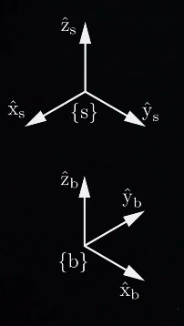

# Matrizes de Rotação

Neste tópico, vamos focar na **orientação de um corpo rígido**. O objetivo é entender como representamos a orientação de um corpo utilizando **matrizes de rotação**.

## Representação dos Quadros de Referência
Vamos considerar dois quadros de referência: {s} e {b}:

Os quadros são mostrados em locais diferentes, mas nosso foco está nas **orientações** desses quadros em relação a um sistema comum.

Podemos expressar a orientação do referencial {b} em relação ao referencial {s} escrevendo os eixos de coordenadas unitárias.
As matrizes que representam os eixos coordenados em relação ao sistema de coordenadas referencial são:

$$
\hat{x}_b = \begin{bmatrix} 0 \\ 1 \\ 0 \end{bmatrix}, \quad
\hat{y}_b = \begin{bmatrix} -1 \\ 0 \\ 0 \end{bmatrix}, \quad
\hat{z}_b = \begin{bmatrix} 0 \\ 0 \\ 1 \end{bmatrix}
$$

### Matriz de Rotação
Para representar a **matriz de rotação** completa que descreve a orientação do sistema {b} em relação ao sistema {s}, podemos combinar os vetores \( \hat{x}_b \), \( \hat{y}_b \) e \( \hat{z}_b \) como colunas em uma única matriz:

$$
R = \begin{bmatrix}
\hat{x}_b & \hat{y}_b & \hat{z}_b
\end{bmatrix}
= \begin{bmatrix}
0 & -1 & 0 \\
1 & 0 & 0 \\
0 & 0 & 1
\end{bmatrix}
$$

Observe que, apesar do espaço de orientações de um corpo rígido ter apenas 3 dimensões, a matriz de rotação possui 9 números. Isso implica que as 9 entradas da matriz estão sujeitas a 6 restrições.

#### Restrições das Matrizes de Rotação
Essas 6 restrições podem ser explicadas da seguinte forma:
1. Três dessas restrições indicam que **os vetores coluna da matriz \( R \) são unitários**, ou seja, cada coluna tem comprimento igual a 1.
2. As outras três que faltam indicam que **os vetores coluna são ortogonais entre si**, ou seja, o produto escalar de quaisquer dois vetores coluna é zero (eles devem formar uma base ortonormal, isto é, fazem ângulos de 90 graus entre si).

Essas **seis restrições** fazem com que a matriz \( R \) seja uma **matriz ortogonal**, o que significa que:

$$
R \cdot R^T = I
$$

Onde:
- \( R \) é a matriz de rotação.
- \( R^T \) é a transposta de \( R \).
- \( I \) é a matriz identidade.

Essas restrições também garantem que o **determinante** de \( R \) seja **1**, o que corresponde a sistemas de coordenadas **dextrígros** (destros). **Não utilizaremos sistemas levógiros (canhotos)**, portanto, o determinante de \( R \) será sempre 1.

---

O conjunto de todas as matrizes de rotação é chamado de **grupo ortogonal especial** $SO(3)$, que é o conjunto de todas as matrizes reais $3 \times 3$ $R$ tais que:

- \( R^T \cdot R = I \)
- \( \det(R) = 1 \)

Onde:
- \( R^T \) é a transposta de \( R \),
- \( I \) é a matriz identidade,
- \( \det(R) \) é o determinante de \( R \).

---

## Propriedades das matrizes de rotação

1. **Inversa**: A inversa de uma matriz de rotação é igual à sua transposta:
   $$
   R^{-1} = R^T \quad \text{e} \quad R \in SO(3) \\\\
   \text{ou seja, é uma matriz de rotação}
   $$
   

2. **Produto Matricial**: O produto de duas matrizes de rotação também é uma matriz de rotação:
   $$
   R_1 R_2 \in SO(3)
   $$

3. **Associatividade**: O produto de matrizes de rotação é associativo:
   $$
   (R_1 R_2) R_3 = R_1 (R_2 R_3)
   $$

4. **Não Comutatividade**: O produto de matrizes de rotação **não é comutativo**, ou seja:
   $$
   R_1 R_2 \neq R_2 R_1
   $$

Além disso, qualquer vetor \( x \) de dimensão \( 3 \times 1 \) multiplicado pela matriz de rotação \( R \) tem o mesmo comprimento que \( x \):

$$
x \in \mathbb{R}^3, \quad ||R x|| = ||x||
$$

**Isso significa que rotacionar um vetor não altera o seu comprimento.**

#
No próximo tópico, veremos usos comuns de matrizes de rotação. 