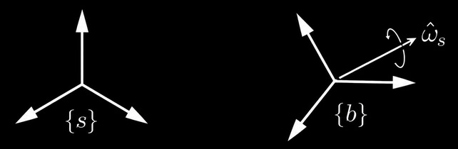
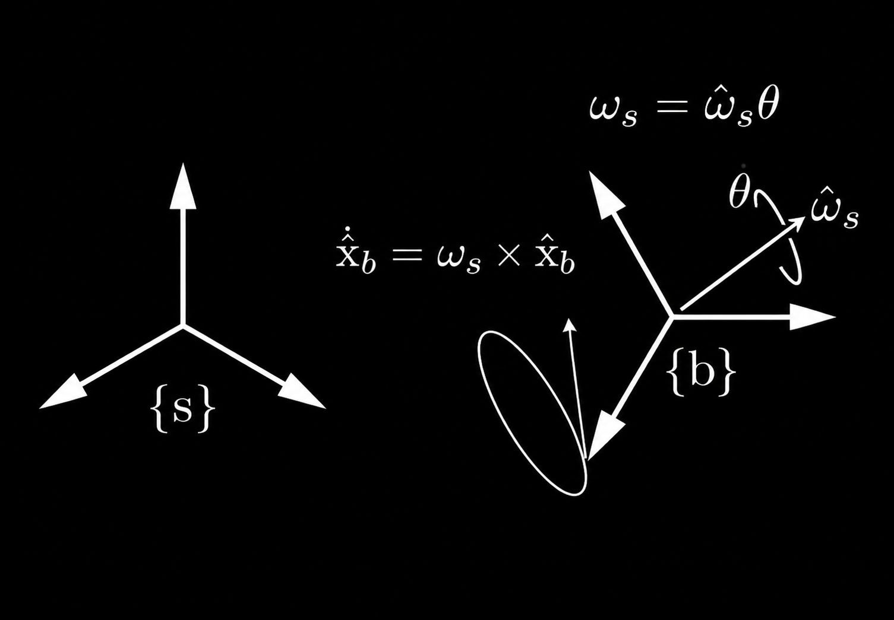
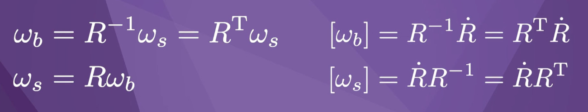

# Velocidades Angulares

Vamos considerar \( R \) como a matriz de rotação que descreve a transformação entre dois sistemas de coordenadas, \( \{b\} \) e \( \{s\} \). A ideia é definir a taxa de rotação de \( \{b\} \), também conhecida como **velocidade angular** \( \dot{R} \), que corresponde à taxa de variação temporal de \( R \). No entanto, essa definição envolve 9 variáveis, e o objetivo é representar a velocidade angular usando apenas 3.
Para isso, seguiremos com a seguinte abordagem:
Imagine um sistema de coordenadas \( \{b\} \), no qual passa um eixo de rotação. A velocidade angular pode ser representada por esse eixo de rotação e pela velocidade de rotação em torno dele, seguindo a regra da mão direita. Esse eixo de rotação pode ser expresso como um vetor unitário no sistema de coordenadas \( \{s\} \), e o representamos como:

O vetor de velocidade angular é dado pela multiplicação do vetor unitário do eixo de rotação com a velocidade angular desse eixo: 

$$
\vec{\omega}_s = \hat{\omega}_s \cdot \dot{\theta}
$$

Isso está expresso no sistema de coordenadas \( \{s\} \).

À medida que a estrutura gira em torno do eixo, o eixo \( x \) da estrutura \( \{b\} \) descreve um círculo.  
A velocidade linear do eixo \( x \) está em uma direção tangente a esse círculo e é calculada como:

$$
\dot{\hat{x}}_b = \vec{\omega}_s \times \hat{x}_b
$$

Onde o símbolo \( \hat{x}_b \) representa o vetor unitário de \( x \), e o ponto \( \dot{} \) denota a velocidade tangencial.

A mesma ideia é feita para as outras coordenadas: 

$$
\dot{\hat{x}}_b = \vec{\omega}_s \times \hat{x}_b
$$

$$
\dot{\hat{y}}_b = \vec{\omega}_s \times \hat{y}_b
$$

$$
\dot{\hat{z}}_b = \vec{\omega}_s \times \hat{z}_b
$$

Como frequentemente calculamos o produto vetorial de um vetor com outro, definimos uma notação entre colchetes que nos permite escrever:

$$
\vec{x} \times \vec{y} = [\vec{x}] \vec{y}
$$

Em que \( [\vec{x}] \) é uma representação matricial \( 3 \times 3 \) do vetor tridimensional \( \vec{x} \):

$$
\vec{x} = \begin{bmatrix} x_1 \\ x_2 \\ x_3 \end{bmatrix} \in \mathbb{R}^3, \quad 
[\vec{x}] = \begin{bmatrix}
0 & -x_3 & x_2 \\
x_3 & 0 & -x_1 \\
-x_2 & x_1 & 0
\end{bmatrix}
$$

Além disso, a matriz \( [\vec{x}] \) é antissimétrica, ou seja:

$$
[\vec{x}] = -[\vec{x}]^T
$$

Dessa forma, podemos escrever a relação entre \( \dot{R} \) e a velocidade angular \( \omega_s \) como:

$$
\dot{R}_{sb} = [\dot{\hat{x}}_b, \dot{\hat{y}}_b, \dot{\hat{z}}_b] = [\omega_s] R_{sb}
$$

O vetor velocidade angular pode ser expresso em outros referenciais, não apenas no referencial {s}

